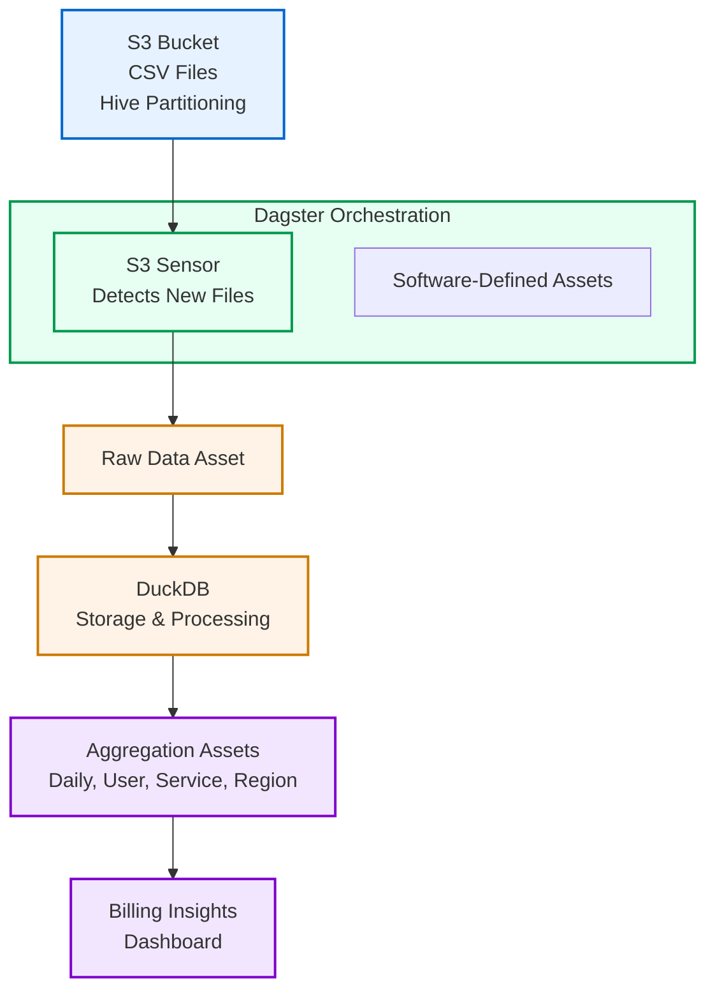
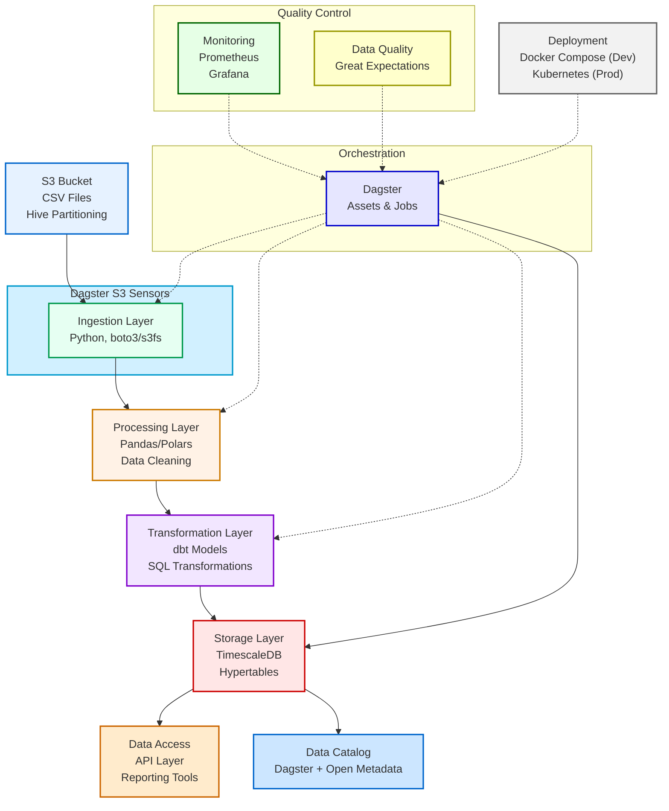

# Billing Data Pipeline

A production-grade data pipeline for processing, analyzing, and deriving insights from billing data stored in a Hive-partitioned S3 bucket.

## Overview

This project demonstrates a streamlined approach to building data pipelines using Dagster and DuckDB. It ingests billing data from an S3 bucket with Hive partitioning, processes it incrementally, and creates various aggregations and insights to support business decision-making.

### Key Features

- **Incremental processing** of data as new files arrive
- **S3 integration** with Hive partition detection
- **Multiple aggregation levels** (daily, user, service, region)
- **Automated dashboard aggregations** with key business insights
- **Scheduling and sensors** for automated processing
- **Backfilling capability** for historical data
- **Full lineage tracking** via Dagster's asset model

## Architecture

### Simplified Architecture (Current Implementation)

For rapid development and prototyping, this project uses a streamlined architecture that can be implemented in about an hour:



**Technology Stack:**
- **Dagster**: Orchestration, scheduling, and asset management
- **DuckDB**: Fast SQL analytics engine for data processing and storage
- **S3FS**: S3 integration with Hive partition support
- **Python**: Core implementation language

### Future Production Architecture

The project is designed to scale to a more robust architecture as needs evolve:



## Project Structure

```
.
├── architecture-simple.md     # Simplified architecture documentation
├── architecture.md            # Full architecture documentation
├── configs/                   # Configuration files
│   └── backfill.yaml          # Backfill configuration
├── data/                      # Data storage
│   ├── billing.duckdb         # DuckDB database
│   └── raw/                   # Raw data files
│       └── billing-2025-04-23.csv
├── pipeline/                  # Pipeline code
│   ├── __init__.py
│   ├── assets/                # Dagster assets organized by function
│   │   ├── __init__.py
│   │   ├── aggregates.py      # Aggregation assets
│   │   ├── ingest.py          # Data ingestion assets
│   │   └── reports.py         # Reporting and insights assets
│   ├── pipeline.py            # Main pipeline definition
│   ├── s3_utils.py            # S3 utilities and Hive partition handling
│   └── utils.py               # General utilities
├── pyproject.toml             # Project dependencies and metadata
├── README.md                  # This file
└── uv.lock                    # Dependency lock file
```

## Installation

### Prerequisites

- Python 3.12 or higher
- Access to an S3 bucket with billing data (or local files for development)

### Setup

1. Clone the repository:
   ```bash
   git clone https://github.com/brylie/billing-data-pipeline.git
   cd billing-data-pipeline
   ```

2. Create and activate a virtual environment:
   ```bash
   uv sync
   source .venv/bin/activate  # On Windows: .venv\Scripts\activate
   ```

## Usage

### Running the Dagster UI

Start the Dagster development server:

```bash
dagster dev -m pipeline
```

Then open http://localhost:3000 in your browser to access the Dagster UI.

### Materializing Assets

In the Dagster UI:
1. Navigate to the "Assets" tab
2. Select assets to materialize
3. Click "Materialize Selected"

### Running the Pipeline via CLI

Process all assets:

```bash
dagster job execute -m pipeline.pipeline -j process_billing_data
```

### Backfilling Historical Data

To backfill data for a specific date range:

```bash
dagster job execute -m pipeline.pipeline -j process_billing_data --config configs/backfill.yaml
```

Example `backfill.yaml` file:
```yaml
ops:
  billing_files:
    config:
      from_date: "2025-03-01"  # Start date for backfill
      to_date: "2025-04-23"    # End date for backfill
```

### Scheduling and Sensors

The pipeline includes:

- **Daily Schedule**: Runs at midnight UTC to process the previous day's data
- **S3 Partition Sensor**: Detects new Hive partitions in the S3 bucket (checks every 5 minutes)
- **File Sensor**: Detects local file changes (checks hourly)

## Data Schema

The billing data has the following schema:

| Column | Type | Description |
|--------|------|-------------|
| timestamp | datetime | When the billing event occurred |
| resource_id | string | Unique identifier for the resource |
| user_id | integer | Identifier for the user |
| credit_usage | float | Amount of credits used (negative values) |
| region | string | Geographic region code |
| service_tier | string | Service tier (e.g., free, standard) |
| operation_type | string | Type of operation performed |
| success | boolean | Whether the operation succeeded |
| resource_type | string | Type of resource used |
| invoice_id | string | Identifier for the invoice |
| currency | string | Currency code (e.g., USD, EUR) |
| year | integer | Year from Hive partition |
| month | integer | Month from Hive partition |
| day | integer | Day from Hive partition |

## Exploring the Data

If you have DuckDB installed, you can explore the data interactively:

```bash
duckdb -ui
```

In the DuckDB UI, add a connection to the DuckDB database file:

1. Next to "Attached database", click "Add database"
2. Enter `data/billing.duckdb` in the "Path" field
3. Click "Add database" to attach the database

You will then be able to run SQL queries against the data and use the DuckDB UI to explore the data interactively.

## Generated Insights

The pipeline generates the following insights:

1. **Daily Aggregates**:
   - Total credit usage by day
   - Transaction counts and success rates
   - Unique users and resources

2. **User Aggregates**:
   - Credit usage patterns by user
   - Resource utilization metrics
   - Activity timelines

3. **Service Aggregates**:
   - Usage patterns by service tier and resource type
   - Operation success rates
   - Credit consumption by operation type

4. **Region Aggregates**:
   - Geographic distribution of usage
   - Regional performance metrics

5. **Comprehensive Insights Dashboard**:
   - Most active users
   - Most resource-intensive regions
   - Operation type distribution
   - Service tier performance

## Idempotency and Fault Tolerance

The pipeline implements several strategies for idempotency:

1. **Database UPSERT operations** prevent duplicate data
2. **Cursors in sensors** track processed files and partitions
3. **Date-based partitioning** enables targeted reprocessing
4. **Unique run keys** prevent duplicate pipeline executions

## Extending the Pipeline

### Adding New Aggregations

1. Create a new asset function in `pipeline/assets/aggregates.py`
2. Update dependencies between assets as needed
3. Add the new asset to the pipeline definition in `pipeline.py`

### Switching to a Different Database

The modular design allows easy replacement of DuckDB with other databases:

1. Create a new resource in `pipeline.py` for your database
2. Update asset functions to use the new resource
3. Modify SQL queries as needed for the new database dialect

## Future Enhancements

Potential improvements for production use:

1. **Integration with dbt** for more robust SQL transformation management
2. **Data quality checks** using Great Expectations
3. **Enhanced monitoring** with Prometheus and Grafana
4. **Cloud deployment** using Docker and Kubernetes
5. **Currency normalization** for accurate financial reporting across currencies

## Design Decisions

### Why DuckDB?

- **Performance**: Excellent for analytical queries on CSV data
- **Simplicity**: Zero configuration database with SQL interface
- **Direct CSV querying**: Can query CSV files without loading them
- **Low resource usage**: Runs in-process without a database server

### Why Dagster?

- **Asset-based orchestration**: Models data assets and their relationships
- **Built-in lineage**: Automatically tracks data flow
- **Strong typing**: Type-safe data passing between assets
- **Incremental processing**: First-class support for incremental workflows
- **Integrated observability**: Rich metadata and monitoring

### Simplified Architecture Benefits

1. **Rapid implementation**: Complete solution in ~1 hour
2. **Minimal infrastructure**: Runs locally with standard Python libraries
3. **Separation of concerns**: Modular design for extensibility
4. **Clear upgrade path**: Can evolve to the full architecture as needed

## License

This project is licensed under the MIT License - see the LICENSE file for details.