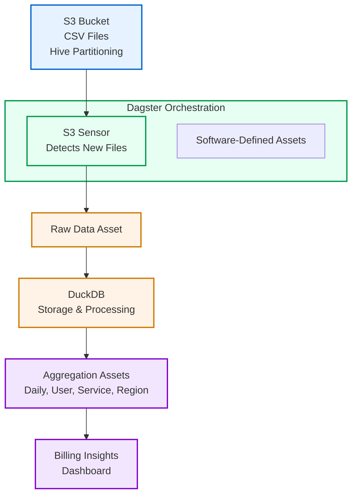

# Billing Data Pipeline: Simplified Architecture

## Overview

This document outlines a streamlined architecture for processing billing data from an S3 bucket, designed for rapid implementation and prototyping. The architecture focuses on simplicity and speed of development while still meeting core requirements for ingesting, processing, and analyzing CSV billing data with Hive partitioning.

### Key Requirements

- Ingest CSV files from S3 with Hive partitioning (year=YYYY/month=MM/day=DD)
- Process new files incrementally as they arrive
- Create aggregations and insights (sums, averages, etc.)
- Implement in approximately 1 hour
- Ensure full idempotency in the pipeline

## Simplified Architecture Diagram

## Streamlined Technology Stack

| Component | Technology | Rationale |
|-----------|------------|-----------|
| Data Source | S3 Bucket | Source data already in S3 with Hive partitioning |
| Orchestration | Dagster | Asset-based orchestration with incremental processing support |
| Processing & Storage | DuckDB | Fast SQL analytics engine with direct CSV reading capabilities |
| Code | Python | Rapid development with excellent library support |

### Why this streamlined approach?

- **Dagster**: Provides asset-oriented orchestration, lineage tracking, and scheduling with minimal configuration
- **DuckDB**: SQL-based analytics engine that can query CSV files directly and efficiently handle millions of rows
- **Single shared connection**: Using Dagster resources to manage a single DuckDB connection prevents file locking issues
- **Minimal dependencies**: No need for separate storage systems, message queues, or containerization for prototyping

## Data Flow

### Discover & Ingest
- Dagster sensor detects new CSV files in S3 (or local directory during development)
- Raw data is registered as a Dagster asset

### Process & Store
- DuckDB directly queries the CSV files using SQL
- Data is stored in DuckDB tables for efficient querying
- SQL-based transformations create analytical views

### Aggregate & Analyze
- Multiple aggregation assets provide different analytical views:
  - Daily aggregates (credit usage by day)
  - User aggregates (usage patterns by user)
  - Service tier aggregates (usage by service and resource type)
  - Regional aggregates (geographic distribution)

### Generate Insights
- High-level insights combine multiple aggregations
- Markdown reports are generated with key findings
- All assets maintain lineage and metadata in Dagster

## Development Workflow

1. **Setup**: Simple pip installation of dependencies
2. **Local Development**:
   - Work with sample CSV files in a local directory
   - Iterate on SQL transformations rapidly
   - Test with Dagster UI (localhost:3000)
3. **Deployment**:
   - Deploy as a simple Python application
   - Connect to actual S3 bucket in production

## Evolution Path

This simplified architecture provides a solid foundation that can evolve as needed:

### Storage Evolution
- Replace DuckDB with **TimescaleDB** for time-series optimization
- Switch to **BigQuery**, **Snowflake**, or **Redshift** for cloud-scale analytics
- Add **data lake** storage for raw data preservation

### Transformation Evolution
- Integrate **dbt** for version-controlled, testable SQL transformations
- Separate transformation logic from pipeline code
- Build test coverage for critical transformations

### Orchestration Expansion
- Add **data quality** checks with Great Expectations
- Implement **monitoring** and alerting
- Scale with **containerization** using Docker and Kubernetes

## Benefits of Simplified Approach

1. **Speed of Implementation**: Complete solution in ~1 hour vs. days/weeks
2. **Minimal Infrastructure**: Run locally with standard Python libraries
3. **SQL-Based Analytics**: Familiar syntax for data analysis
4. **Built-in Lineage**: Dagster tracks data flow automatically
5. **Easy Incremental Processing**: Detect and process only new files
6. **Full Idempotency**: Safe to rerun without duplicating data
7. **Simple Maintenance**: Few moving parts means less to maintain

## Implementation Details

The implementation consists of:

1. A shared **DuckDB resource** in Dagster to prevent file locking
2. **Software-defined assets** for each data processing step
3. SQL queries to transform and aggregate data
4. A sensor to detect new files
5. An hourly schedule for regular updates

## Conclusion

This streamlined architecture demonstrates that complex data processing requirements can be met with a deliberately simplified technology stack. By focusing on the essential components and leveraging powerful but lightweight tools like Dagster and DuckDB, we can rapidly prototype a fully functional data pipeline that meets all core requirements while maintaining a clear path to future enhancements.
