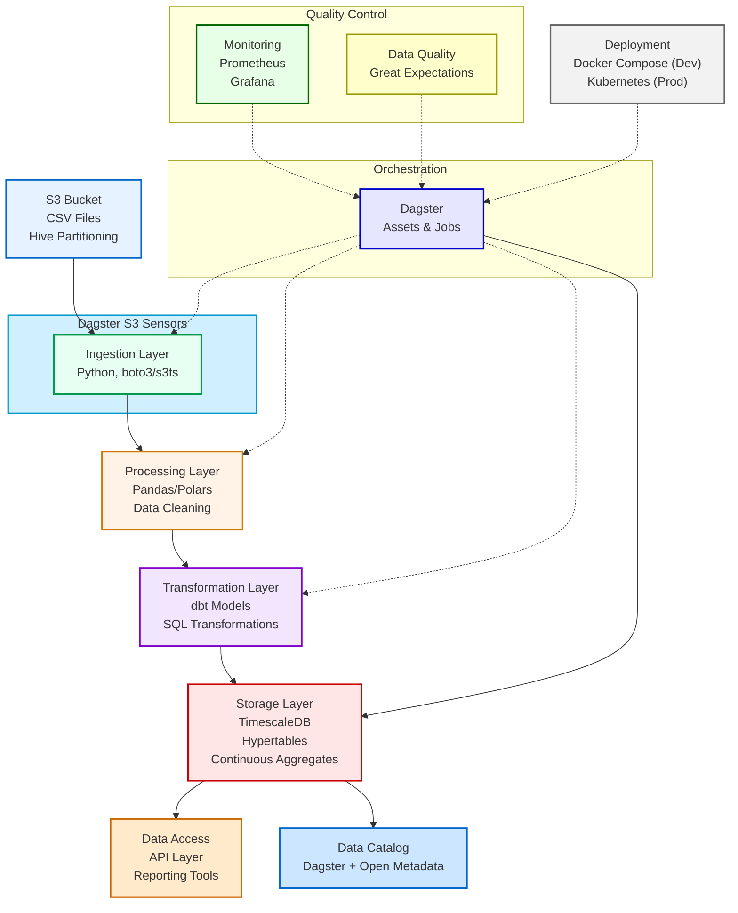

# Billing Data Pipeline Architecture

## Overview

This document outlines the architecture for a robust data pipeline that processes billing data stored in an Amazon S3 bucket. The pipeline ingests, processes, and analyzes billing data stored as CSV files with Hive partitioning, creating dynamic insights such as aggregations that update as new data arrives.

### Key Requirements

- Ingest CSV files from S3 with Hive partitioning (year=YYYY/month=MM/day=DD)  
- Process new files incrementally as they arrive  
- Create aggregations and insights, such as sums and averages, to gain a deeper understanding  
- Support both local development and cloud deployment  
- Enable streaming ingestion (optional)  
- Implement data catalog and lineage (optional)  
- Ensure full idempotency throughout the pipeline

## Technology Stack

| Component | Technology | Rationale |
| :---- | :---- | :---- |
| Data Source | S3-compatible Object Storage | The source data is already stored in S3 with Hive partitioning |
| Ingestion | Python (boto3/s3fs/fsspec) | Flexible libraries for S3 access with partitioning support |
| Processing | Pandas/Polars | Efficient data processing libraries with rich functionality |
| Transformation | dbt | SQL-based transformations with version control and testing |
| Storage | TimescaleDB | Time-series optimized PostgreSQL with automatic aggregations |
| Orchestration | Dagster | Asset-oriented orchestration with strong typing and testing capabilities |
| Local Development | Docker Compose | Containerized environment with all necessary services |
| Deployment | Kubernetes | Scalable container orchestration for cloud deployment |
| Monitoring | Prometheus \+ Grafana | Industry standard for metrics collection and visualization |
| Data Quality | Great Expectations | Data validation framework with rich testing capabilities |

### Why these choices?

- Dagster over Airflow/Prefect: Dagster provides asset-based orchestration, strong typing, and excellent integration with data quality testing and observability  
- TimescaleDB: Specialized for time-series data with features like continuous aggregates and hypertables  
- dbt: Enables version-controlled, testable SQL transformations  
- Polars (optional): Faster alternative to Pandas for large datasets

## Architecture Design

### Components

#### Data Ingestion Layer

- S3 Connector: Uses boto3/s3fs to access the S3 bucket  
- Partition Discovery: Automatically detects Hive partitions (year/month/day)  
- File Processing: Reads CSV files, handles headers, and data types  
- Incremental Loading: Tracks processed files to only process new data

#### Data Processing Layer

- Data Cleaning: Handles missing values, inconsistent formats  
- Data Enrichment: Adds derived columns, lookups from reference data  
- Schema Validation: Validates incoming data against the expected schema

#### Transformation Layer (dbt)

- Staging Models: Initial models that represent raw data  
- Intermediate Models: Cleaned and prepared data models  
- Mart Models: Business-specific analytical models  
- Continuous Aggregations: TimescaleDB materialized views for aggregations

#### Storage Layer

- TimescaleDB: Stores processed data in hypertables  
- Hypertables: Time-partitioned tables for efficient querying  
- Continuous Aggregates: Automatically updated materialized views

#### Orchestration Layer

- Dagster Assets: Defines data assets and their dependencies  
- Scheduling: Triggers pipeline runs on a schedule  
- Sensors: Detects new data files in S3  
- Retry Logic: Handles temporary failures and retries  
- Materialization: Tracks asset materializations with metadata  
- Type Checking: Enforces I/O contracts between assets

#### Monitoring Layer

- Data Quality Metrics: Measures data quality and completeness  
- Processing Metrics: Tracks pipeline performance  
- Alerting: Notifies of pipeline failures or data issues

## Data Flow

### Discover New Data:

- The pipeline scans the S3 bucket for new partitions  
- Only partitions not previously processed are considered

### Data Extraction:

- CSV files are read from S3 using boto3/s3fs  
- Hive partition information is extracted from file paths  
- Files are loaded into pandas/polars DataFrames

### Data Preparation:

- Data is validated against the expected schema  
- Missing values are handled according to business rules  
- Data types are standardized  
- Partition columns are added if not present in the data

### Load to Storage:

- Clean data is loaded into TimescaleDB hypertables  
- Insert operations use UPSERT to handle duplicates (idempotency)

### Transformation:

- dbt models transform raw data into analytical models  
- SQL transformations create normalized views  
- Business logic is applied in transformation layers

### Aggregation:

- TimescaleDB continuous aggregates automatically update  
- Pre-aggregated views optimize query performance

### Exposure:

- Aggregated data is exposed for reporting  
- APIs provide access to insights data

## Local Development Environment

The local development environment uses Docker Compose to create a self-contained system with all necessary components.

### Development Workflow

- Local Data: Sample data can be loaded into MinIO (S3 compatible)  
- Development Cycle:  
  - Develop ingestion scripts locally  
  - Run dbt models against local TimescaleDB  
  - Test transformations with dbt test  
- Testing: Unit tests and integration tests validate the pipeline  
- Deployment: Docker images are built and deployed to the cloud

## Cloud Deployment

For cloud deployment, the pipeline components are deployed using Kubernetes:

- Kubernetes Manifests: Define deployments, services, and secrets  
- Helm Charts: Package component configurations  
- CI/CD: Automated deployment via GitHub Actions

## Incremental Processing

Incremental processing is a key design principle to ensure efficiency:

- Metadata Tracking: Keep track of processed partitions in a metadata table  
- Change Detection: Detect new files based on S3 metadata (last modified)  
- Incremental Loading: Only process new or changed files  
- Idempotent Operations: All operations can safely be repeated

## Bonus Features

### Streaming Ingestion

For real-time processing, the architecture leverages Dagster's built-in capabilities:

- Dagster S3 Sensors: Monitor S3 buckets for new file arrivals  
- Event-Driven Processing: Trigger pipeline runs as soon as new data is detected  
- Near Real-Time Insights: Process data shortly after it arrives

Note: We're intentionally avoiding Kafka to keep the architecture simpler with fewer moving parts. Kafka would only be necessary if we needed to integrate with additional streaming data sources beyond S3. By avoiding Kafka, we maintain a simpler architecture that is easier to manage and understand.

### Data Catalog

A data catalog improves discovery and governance:

- Metadata Store: Captures table definitions, schemas, lineage  
- Documentation: Automatically generated documentation  
- Search: Find and understand available data assets

### Data Lineage

Data lineage tracking provides transparency and auditability:

- Lineage Graph: Tracks data from source to output  
- Impact Analysis: Understand changes before implementing  
- Troubleshooting: Trace issues back to root causes

Dagster will serve as the primary component responsible for lineage tracking:

- Dagster natively tracks assets and their dependencies  
- Its software-defined asset (SDA) model provides automated lineage visualization  
- Consider integrating with Open Metadata for a global overview of:  
  - Data sources  
  - Transformations  
  - End consumers  
  - Cross-system lineage tracking

### Full Idempotency

The pipeline is designed to be fully idempotent:

- Unique Keys: Use natural keys for all records with caution  
  - **Important Note**: Natural key structures may change over time, potentially breaking integrations  
  - Document key structures thoroughly, especially composite keys  
  - Consider including a synthetic UUID alongside natural keys for stability  
- UPSERT Operations: Replace or update existing records  
- Checksums: Track file checksums to detect changes  
- Deterministic Processing: Same input always produces the same output

## Implementation Plan

### Phase 1: Core Functionality

- Set up Docker Compose environment  
- Implement S3 data ingestion  
- Create TimescaleDB schema  
- Build basic dbt models  
- Develop Dagster assets and jobs

### Phase 2: Refinement

- Add incremental processing  
- Implement data quality checks  
- Create continuous aggregates  
- Develop monitoring and alerting

### Phase 3: Advanced Features

- Implement Dagster S3 sensors for near real-time processing  
- Implement a data catalog with possible Open Metadata integration  
- Set up Dagster's native lineage tracking capabilities  
- Create additional business-specific aggregations  
- Develop an API layer for data access

### Phase 4: Production Readiness

- Security hardening  
- Performance optimization  
- Documentation and knowledge transfer  
- Production deployment and validation

## Risks and Mitigations

### Data Volume Risks

- Risk: Data volume growth exceeds processing capacity  
- Mitigation: Implement horizontal scaling and partitioning strategies

### Data Quality Risks

- Risk: Source data quality issues impact analytics  
- Mitigation: Robust validation, monitoring, and alerting on data quality metrics

### Technical Risks

- Risk: Integration complexity between components  
- Mitigation: Thorough testing, clear interfaces, and component isolation

### Operational Risks

- Risk: Deployment and maintenance complexity  
- Mitigation: Automation, documentation, and observability
